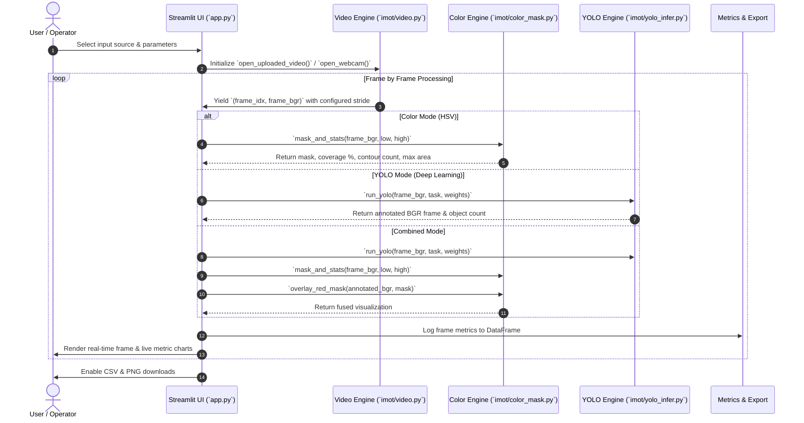

# 🎯 Intelligent Multi-Modal Object & Color Tracking (IMOT)
# Streamlit app lnk-https://intelligent-multi-modal-object-color-tracking.streamlit.app

[](https://www.python.org/downloads/)
[](https://opencv.org/)
[](https://github.com/ultralytics/ultralytics)
[](https://streamlit.io/)

**IMOT (Intelligent Multi-Modal Object & Color Tracking)** is an end-to-end computer vision and behavioral analysis platform that unifies **classical colorimetric image processing (HSV space masking & contour analytics)** with **deep-learning neural perception (YOLOv8 Object Detection, Instance Segmentation, and Pose Estimation)**.

The project features a modular Python backend, standalone prototype pipelines for rapid experimentation, and an interactive **Streamlit** dashboard for real-time video, image, and webcam analytics.

---

## 🏛️ System Architecture

```mermaid
flowchart TD
    subgraph Inputs["1. Multi-Modal Input Ingestion"]
        A1["Live Webcam Stream"]
        A2["Webcam Snapshot"]
        A3["Image Upload (PNG/JPG/BMP/WEBP)"]
        A4["Video Upload (MP4/AVI/MOV/MKV)"]
    end

    subgraph Processing["2. Video & Ingestion Layer (`imot.video`)"]
        B1["VideoSource Handler"]
        B2["Temporary File Lifecycle Manager"]
        B3["`iter_frames()` Generator"]
        B4["Frame Striding & Max-Frame Rate Limiter"]
    end

    subgraph Dispatcher["3. Streamlit Pipeline Controller (`app.py`)"]
        C1{"Pipeline Mode"}
    end

    subgraph ColorPipeline["4A. Classical Color Processing (`imot.color_mask`)"]
        D1["BGR to HSV Conversion"]
        D2["Color Thresholding (`inRange`)"]
        D3["Preset Ranges (Red, Blue, Green, Non-White)"]
        D4["Custom 6-Param HSV Sliders"]
        D5["Contour Extraction & Area Metrics"]
        D6["Red Mask Alpha Overlay (`cv2.addWeighted`)"]
    end

    subgraph YoloPipeline["4B. Deep Learning Inference (`imot.yolo_infer`)"]
        E1["YOLOv8 Model Loader (`detect`, `segment`, `pose`)"]
        E2["Weights Auto-Download & Cache (`*.pt`)"]
        E3["Inference Engine & Confidence Filtering"]
        E4["Annotation Plotting (`results[0].plot()`)"]
        E5["Object Count Telemetry"]
    end

    subgraph FusionLayer["4C. Multi-Modal Fusion"]
        F1["Sequential Pipeline Execution: YOLO -> Color Overlay"]
        F2["Unified Statistical Aggregation"]
    end

    subgraph Outputs["5. Visualization & Telemetry Export"]
        G1["Real-Time Streamlit Display Canvas"]
        G2["Download Processed PNGs & Masked Extractions"]
        G3["Live DataFrames & Metric Cards"]
        G4["CSV Telemetry Reports (`coverage`, `contours`, `counts`)"]
    end

    Inputs --> Processing
    Processing --> Dispatcher
    Dispatcher -->|"Tab 1: Colour Detection"| ColorPipeline
    Dispatcher -->|"Tab 2: Object Detection"| YoloPipeline
    Dispatcher -->|"Tab 3: Combined Mode"| FusionLayer

    ColorPipeline --> FusionLayer
    YoloPipeline --> FusionLayer

    ColorPipeline --> Outputs
    YoloPipeline --> Outputs
    FusionLayer --> Outputs
```

---

## 🧩 Architectural Layers & Data Flow



---

## 📁 Repository Structure

```
Intelligent Multi-Modal Object & Color Tracking/
│
├── app.py                          # Main Streamlit web application & multi-modal dashboard
├── requirements.txt                # Python runtime dependencies
├── yolov8n.pt                      # Cached YOLOv8 nano detection model weights
├── README.md                       # Comprehensive documentation & architecture reference
│
├── imot/                           # Core reusable computer vision library
│   ├── __init__.py                 # Package declaration
│   ├── color_mask.py               # HSV color presets, masking, contour metrics & overlay
│   ├── video.py                    # Video capture, webcam abstractions, frame generators
│   └── yolo_infer.py               # YOLOv8 inference wrapper (detect, segment, pose)
│
├── Colur Dtection/                 # Standalone OpenCV color detection prototypes
│   ├── CV1_ capture videos.py      # Basic webcam capture and HSV color space demo
│   ├── CV2_ Red color mask.py      # Red hue thresholding & isolation
│   ├── CV3_ Blue color mask.py     # Blue hue thresholding & isolation
│   ├── CV4_ Green color mask.py    # Green hue thresholding & isolation
│   ├── CV5_ Every color except white mask.py # Chromatic vs achromatic (white) filtering
│   └── test_HSV_Color.py           # Multi-window live color segmentation tester
│
└── Object Detection/               # Standalone YOLOv8 deep learning prototypes
    ├── object_detection.py         # Standard YOLOv8 real-time object detection
    ├── customer_detection.py       # People / customer detection in retail video streams
    ├── object_counting.py          # Real-time object count overlay
    ├── object_segmentation.py      # Instance segmentation with `yolov8n-seg.pt`
    ├── pose_estimation.py          # Human skeleton & pose keypoints (`yolov8n-pose.pt`)
    └── object_tracking.py          # YOLOv8 detection with OpenCV tracking integration
```

---

## ⚙️ Core Modules Breakdown

### 1. `imot.color_mask`
Handles all colorimetric computations in HSV color space:
- **`preset_hsv(name)`**: Provides calibrated HSV bounds for `Red` `[161, 155, 84] -> [179, 255, 255]`, `Blue` `[94, 80, 2] -> [126, 255, 255]`, `Green` `[40, 100, 100] -> [102, 255, 255]`, and `Every color except white` `[0, 42, 0] -> [179, 255, 255]`.
- **`mask_and_stats(bgr_frame, low, high)`**:
  - Converts BGR to HSV (`cv2.cvtColor`).
  - Generates binary mask (`cv2.inRange`).
  - Computes spatial coverage ratio ($\frac{\text{Mask Pixels}}{\text{Total Frame Pixels}}$).
  - Extracts contours (`cv2.findContours`) and computes the largest contour area.
- **`overlay_red_mask(bgr_frame, mask, alpha=0.35)`**: Performs weighted blending (`cv2.addWeighted`) for highlight visualizations.

### 2. `imot.yolo_infer`
Encapsulates Ultralytics YOLOv8 operations:
- **`YoloTask`**: Supports `"detect"`, `"segment"`, and `"pose"`.
- **`default_weights(task)`**: Automatically pairs tasks with default weights (`yolov8n.pt`, `yolov8n-seg.pt`, `yolov8n-pose.pt`).
- **`run_yolo(bgr_frame, task, weights_path)`**: Lazy-loads the neural model, executes forward inference, renders annotations (`results[0].plot()`), and returns object counts.

### 3. `imot.video`
Robust stream and file management:
- **`VideoSource`**: Context-safe dataclass wrapping `cv2.VideoCapture` with automatic temporary file cleanup.
- **`iter_frames(cap, stride=1, max_frames=0)`**: Python generator that efficiently skips frames according to stride parameters and enforces maximum frame limits to prevent memory exhaustion.

### 4. `app.py` (Streamlit Dashboard)
A multi-page interactive interface featuring:
- **Multi-Source Input**: Live webcam, webcam snapshot capture, image files, or video files.
- **Operational Tabs**:
  1. **Colour Detection (HSV)**: All-color comparison grid, single preset view, custom HSV threshold sliders, processed frame downloads, and statistical CSV export.
  2. **Object Detection (YOLOv8)**: Multi-task neural inference (Detect, Segment, Pose), live object count metrics, and frame-by-frame tracking logs.
  3. **Combined Multi-Modal**: Overlaying color segmentations directly onto YOLO-annotated frames with synchronized metric telemetry.

---

## 🚀 Getting Started

### Prerequisites
- Python 3.9 or higher
- Webcam (optional, for real-time live capture)

### 1. Installation
Clone or navigate to the repository directory and install the required dependencies:

```bash
python -m pip install --upgrade pip
python -m pip install -r requirements.txt
```

### 2. Running the Interactive Streamlit App

```bash
python -m streamlit run app.py
```

Open your browser at `http://localhost:8501`.

### 3. Running Standalone Prototypes

You can also run any of the standalone scripts directly:

#### Color Detection Scripts:
```bash
# Test multi-color HSV isolation on webcam
python "Colur Dtection/test_HSV_Color.py"

# Red color mask only
python "Colur Dtection/CV2_ Red color mask.py"
```

#### Object Detection & Deep Learning Scripts:
```bash
# Object detection & bounding boxes
python "Object Detection/object_detection.py"

# Real-time object counting
python "Object Detection/object_counting.py"

# Instance segmentation
python "Object Detection/object_segmentation.py"

# Pose estimation / Keypoint tracking
python "Object Detection/pose_estimation.py"
```

---

## 📊 Telemetry & Data Logging

The system records real-time behavioral metrics across processed frames:

| Metric Column | Description | Pipeline |
| :--- | :--- | :--- |
| `frame_index` | Sequential index of the processed frame | All |
| `mode` / `preset` | Active color filter mode (Red, Blue, Green, Custom, etc.) | Color & Combined |
| `coverage` | Fraction of total frame area occupied by target color `[0.0 - 1.0]` | Color & Combined |
| `num_contours` | Number of distinct connected color regions detected | Color & Combined |
| `largest_contour_area`| Area (in pixels²) of the largest single color cluster | Color & Combined |
| `num_objects` | Total number of detected entities predicted by YOLOv8 | YOLO & Combined |

All logged data can be exported directly from the UI as CSV files (`colour_mask_stats.csv`, `object_detection_stats.csv`, `combined_stats.csv`).

---

## 🛠️ Technology Stack

- **Computer Vision**: OpenCV (`cv2`), NumPy
- **Deep Learning**: Ultralytics YOLOv8 (PyTorch backend)
- **Data Handling**: Pandas
- **Frontend / UI**: Streamlit

---

## 📝 License
This project is licensed under the MIT License - feel free to use and extend it for research, industrial tracking, or educational purposes.
